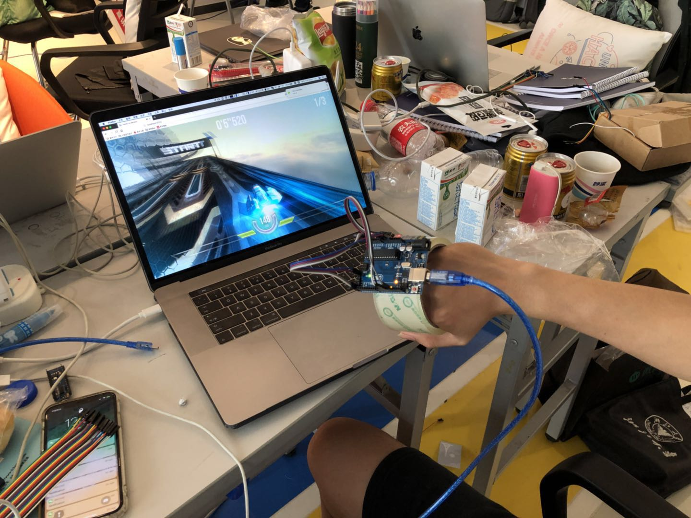

# FlyGuys
---

This is Unique Hackday project called FlyGuys powered by Team 8.

## 文字介绍

### 背景
游戏是一种娱乐，如今随着AR头盔的盛行，很多游戏开始将玩家带入3D体验。本游戏结合青云服务器，为玩家带来富有现场感的3D飞行游戏。
FlyGuys是一款老少皆宜的游戏，通过集成各种陀螺仪、血氧检测等感官模块，让用户获得前所未有的3D游戏体验。
FlyGuys注重用户体验，我们在游戏中加入心率、血氧检测，让玩家实时知晓自己当前身体状态，并加入AI智能算法，在玩家疲惫时候适当降低游戏难度。

---

## 时间安排
第一天： <br>
13：00 确定方案 <br>
15：00 ~ 17：00 熟悉每个模块，确定当前进度 <br>
17：00 ~ 18：00 每个模块基本确定 <br>
18：00 ~ 19：30 晚饭+饭后散步 <br>
20：00 ~ 22：00 基本组装完成 <br>
22：00 ~ 24：00 基本demo完成 <br>

第二天： <br>
00：00 ~ 04：00 模块对接 <br>
06：00 ~ 08：00 封装产品界面 <br>
08：00 ~ 09：00 测试demo、编写说明书 <br>
09：00 ~ 10：00 路演演讲稿 <br>
10：00 ~ 11：00 路演测试（演讲+测试游戏）<br>

---

## 技术实现
* 后端传输：Websocket控制模块，联通体感硬件、前端游戏等模块；
* 前端游戏：展示游戏前端；根据后端代码调控游戏；
* 体感硬件：体感检测数据；通过蓝牙传输到后端；
* 蓝牙模块：蓝牙传输数据，实现Arduino<=>笔记本双向传输。

---

## 接口设置

- 前端、后端、游戏端 Websocket对接API
```
{
    "status": 1,
    "data": "",
    "type": "web/arduino/server"
}
```

- Arduino=>蓝牙数据对接

```
U = up
D = down
L = left
R = right
X = null
```

---
## 产品效果

图片展示：<br>

 <br>

录像展示：<br>
<video src="https://static.blog.homeway.me/blog/video/Unique-Hackday-FluGuys-1.MP4" controls="controls"></video><br>

<video src="https://static.blog.homeway.me/blog/video/Unique-Hackday-FluGuys-2.MP4" controls="controls"></video><br>

<video src="https://static.blog.homeway.me/blog/video/Unique-Hackday-FluGuys-3.MP4" controls="controls"></video><br>

---
## 团队照片


 <br>

 <br>